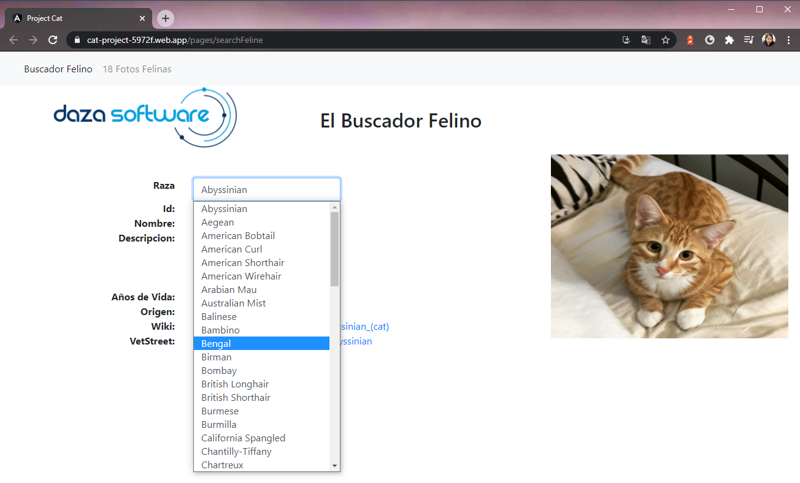
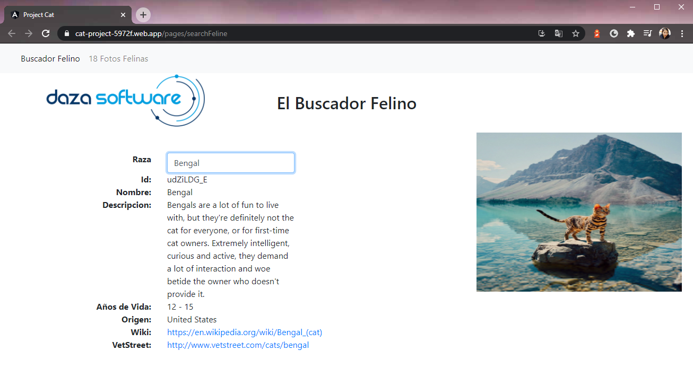
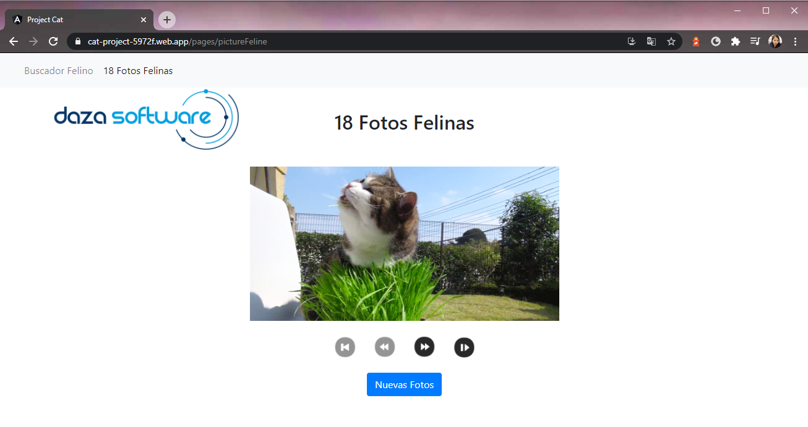

<!-- AUTO-GENERATED-CONTENT:START (STARTER) -->
<h1 align="center">
  Cat Project
</h1>

This project is cat project to help you see a cat breeds guide.

The application must consume a REST Service with information on Cat Breeds and display two pages with the following functionalities:
- Cat Finder: Displays information on the selected Breed in a “Combo Box”.
- 18 Feline Photos: Displays a photo of a feline and allows you to browse among 18 other photos from that list, it also includes an option to upload 18 new photos at random.

## 🚀 Quick start

1.  **Create a new project in Angular.**

    Use the Angular CLI to create a site.

    ```shell
    # create a Angular project cloned from here
    git clone https://github.com/MiriamHuanca/ProjectCat.git
    ```

1.  **Start dependencies.**

    To install dependencies in the application, on the console type...

    ```shell
    cd ProjectCat/
    npm install
    ```

1.  **Start developing.**

    Navigate into your new site’s directory and start it up.

    ```shell
    ng serve
    ```

    Your site is now running at `http://localhost:4200`!

1.  **Build**

    Run ng build to build the project. The build artifacts will be stored in the dist/ directory. Use the --prod flag for a production build.

    ```shell
    ng build --prod
    ```

1.  **Install firebase**

    To install Firebase in the application, on the console type...

    ```shell
    npm install -g firebase-tools
    ```

## 🧐 What's inside?

## 🎓 Learning

Looking for more guidance? Full documentation for Angular lives [on the website](https://angular.io/). Here are some places to start:

- **To dive straight into code samples, head [to our documentation](https://angular.io/docs/).** In particular, check out the _Guides_, _API Reference_, and _Advanced Tutorials_ sections in the sidebar.

## 💫 Deploy

[](https://cat-project-5972f.web.app/)

## An overview to the project

- The first image is the cat breed listing and search according to race.
  
- The second is when you have to new search found.
  
- Ther third shows you the image you have chosen randomly.
  

<!-- AUTO-GENERATED-CONTENT:END -->
